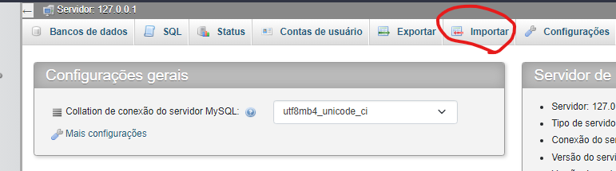
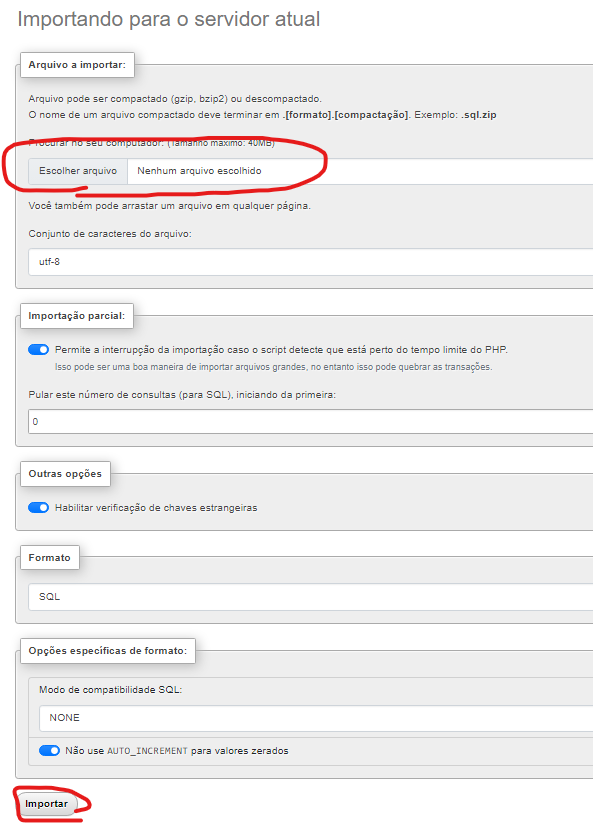

# Trabalho Crud PHP
 Sistema para biblioteca 

 

## Requisitos
- xampp 3.3.0 -> [Download](https://www.apachefriends.org/pt_br/index.html)

## Como rodar

 Para rodar o app basta jogar ele dentro da pasta htdocs, ligar o apache e o mysql no xammp-control,
 após isso importe o arquivo *banco-de-dados.sql*  [PHP admin](http://localhost/phpmyadmin/index.php?route=/)

## Iniciar servidor

 Depois de baixar o codigo e os requisitos basta rodar

### Windows


```powershell
./start.bat
```

### Linux
```bash
sudo ./start.bash
```


 ## Como Importar
 Link [Importar](http://localhost/phpmyadmin/index.php?route=/server/import)
 (link so ira funcionar se o mysql e o apashe estiver ativo)



 Depois de clicar em importar ou abrir direto pelo link e só selecionar o arquivo -> [banco-de-dados.sql](banco-de-dados.sql).





